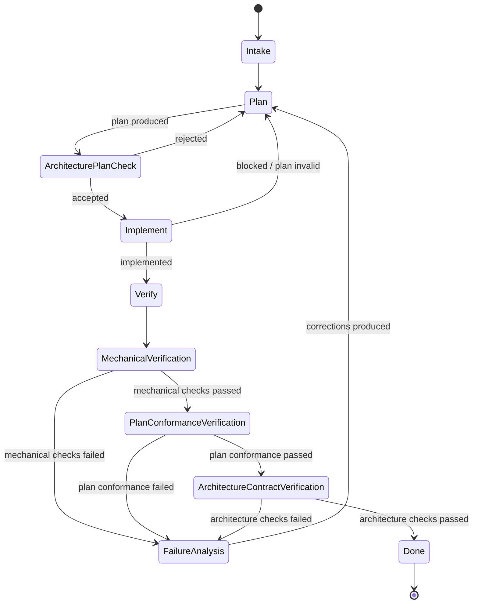

# Agent Workflow

## State machine



## Verification is three-part

Verification has three mandatory phases in full workflow mode:

1. Mechanical verification:

   * format
   * lint
   * typecheck
   * tests
   * flake checks
   * build checks

2. Plan-conformance verification:

   * final diff matches planned files and operations
   * actual changes map to planned change IDs
   * forbidden expansions avoided
   * expected docs/tests/config changes present
   * deviations justified or require replanning

3. Architecture-contract verification:

   * final diff satisfies the accepted architecture contract
   * intended patterns preserved
   * dependency direction preserved
   * module boundaries preserved
   * allowed/forbidden API changes respected
   * no forbidden architecture drift

## Original plan artifacts

Verification is based on original upstream artifacts, not reconstructed summaries.

Every full `/flow` run must maintain:

```text
.opencodestate/request.md
.opencodestate/planner-output.yaml
.opencodestate/implementation-plan.yaml
.opencodestate/planned-changes.yaml
.opencodestate/architecture-review.yaml
.opencodestate/architecture-contract.yaml
.opencodestate/implementation-summary.yaml
```

The verifier uses these artifacts to check:

1. mechanical correctness;
2. conformance to the original implementation plan;
3. conformance to the accepted architecture contract.

### Plan-conformance verification

Checks whether the final diff matches:

* planned files;
* planned operations;
* expected behavior changes;
* expected docs/tests/config changes;
* forbidden expansions;
* expected diff shape.

### Architecture-contract verification

Checks whether the final diff preserves:

* planned architecture patterns;
* dependency direction;
* module boundaries;
* allowed public API changes;
* forbidden public API changes;
* docs/tests/config expectations;
* forbidden architecture drift.

### Missing artifact rule

If a full `/flow` reaches verification without the original plan artifacts, verification must fail.

Standalone `/verify` may run without workflow artifacts, but it must explicitly state that accepted-plan verification was unavailable.

## Transition table

| From                           | To                             | Required condition                                          |
| ------------------------------ | ------------------------------ | ----------------------------------------------------------- |
| Intake                         | Plan                           | User request can be planned                                 |
| Plan                           | ArchitecturePlanCheck          | Planner produced structured plan                            |
| ArchitecturePlanCheck          | Implement                      | Architect returned `status: accepted`                       |
| ArchitecturePlanCheck          | Plan                           | Architect returned `status: rejected`                       |
| Implement                      | Verify                         | Implementer returned `status: implemented`                  |
| Implement                      | Plan                           | Implementer returned `status: blocked`                      |
| Verify                         | MechanicalVerification         | Verifier starts required checks                             |
| MechanicalVerification         | PlanConformanceVerification    | Mechanical checks passed                                    |
| MechanicalVerification         | FailureAnalysis                | Mechanical checks failed                                    |
| PlanConformanceVerification    | ArchitectureContractVerification | Plan conformance passed                                   |
| PlanConformanceVerification    | FailureAnalysis                | Plan conformance failed                                     |
| ArchitectureContractVerification | Done                         | Architecture checks passed                                  |
| ArchitectureContractVerification | FailureAnalysis              | Architecture checks failed                                  |
| FailureAnalysis                | Plan                           | Failure analyzer produced root causes and corrections       |

## Codebase memory use

For non-trivial tasks, `planner`, `architect`, `verifier`, and `failure-analyzer` should use `codebase_memory` tools for structural orientation before making broad claims about the repo.
