# Agent Workflow

## Adaptive task-DAG workflow

Phenix uses one stable frontend agent, `phenix-workflow`. The frontend owns user
interaction, task classification, task DAG construction, durable state,
delegation, escalation, and the final response. Internal execution is selected
from the actual task shape; the agent topology is derived from the task DAG, not
from a fixed sequence.

## WorkScope routing model

Every request is classified into one semantic `WorkScope`. WorkScope is the
single model for task class, complexity, risk, capabilities, routing, invariants,
boundaries, verification, and escalation; agents must not introduce separate
lease classes or role-specific permission taxonomies.

```yaml
WorkScope:
  class: inspect | maintenance | change | release
  complexity: c0 | c1 | c2 | c3 | c4
  risk: trivial | low | medium | high
  capabilities:
    inspect: true
    edit: true | false
    agent_state_write: true
    delete_untracked: true | false
    delete_tracked: false
    run_commands: true | false
    commit: false
    push: false
    publish: false
  routing:
    workflow: classify_and_dispatch
    planner: skip | required
    architect: skip | required
    worker: direct | after_plan | after_architect | after_explicit_approval | skip
    verifier: optional | required | required_strict
    committer: only_after_explicit_user_request
  invariants:
    - no_secret_changes
    - no_permission_weakening
    - no_unrelated_changes
    - no_public_api_change_unless_requested
    - no_test_or_verification_removal_unless_requested
    - preserve_repo_boundaries
    - preserve_declared_flake_outputs
  boundaries:
    max_files_changed:
    max_lines_changed:
```

Default routing:

* `c0` inspect: read-only answers, diagnostics, review, or explanation. Minimal
  preflight; no implementation subagent and no heavyweight `.phenix-agent-state/`
  unless recovery or handoff needs it.
* `c1` trivial maintenance: obvious one-file or small documentation/config
  maintenance. Dispatch directly to worker after minimal preflight when a tracked
  edit is requested and capabilities permit it.
* `c2` mechanical maintenance: localized low-risk mechanical edit with clear
  intent and no architecture, release, destructive, secrets/auth, or permission
  trigger. Dispatch directly to worker after minimal preflight; verifier evidence
  may be lightweight.
* `c3` contained change: semantic behavior change, medium risk, cross-file edit,
  or named ambiguity. Planner is required; architect is conditional.
* `c4` high-risk/release/control-plane: workflow/control-plane, permission model,
  public API/config, flake topology/output, CI/deployment, repo ownership
  boundaries, release, commit/push/publish/deploy, tracked deletion,
  secrets/auth, or high risk. Planner, architect, worker, and strict verifier are
  required.

Planner should not be invoked for c1/c2 mechanical maintenance absent a concrete
ambiguity. Architect is limited to repo topology, public API/config semantics,
flake outputs, permission model, agent routing/workflow semantics, CI/deployment,
module ownership boundaries, or accepted architecture contracts. Cleanup,
formatting, typo fixes, and simple references skip architecture review unless a
boundary is named.

Commit, push, publish, deploy, tracked deletion, secrets/auth changes, and
permission weakening require explicit user approval and c4 handling.

Every WorkScope grants `agent_state_write: true` by default. Agents may write
runtime state, checkpoints, logs, handoff notes, and verification evidence under
`.phenix-agent-state/**` without additional user confirmation. This permission is
path-scoped and purpose-scoped: it does not grant source edits, tracked-file
changes, secret writes, permission changes, commits, pushes, publishes, or writes
outside `.phenix-agent-state/**`.

State writes must stay inside `.phenix-agent-state` after canonicalization, reject
path traversal and symlink escape, remain non-executable, avoid secrets, keep
individual files at or below 1 MiB, keep total state at or below 50 MiB, and stay
gitignored/non-committed by default. Any tool may write files only if the active
WorkScope permits the target and operation; Python is not a permission boundary.

For c1/c2 tasks, the workflow agent may write a compact WorkScope and dispatch
note under `.phenix-agent-state/**`, then hand off directly to the worker. It must
not create large DAG/checkpoint scaffolding unless the task spans multiple repos,
fails once, or requires recovery.

Examples:

```yaml
inspect:
  edit: false
  agent_state_write: true
maintenance:
  edit: true
  agent_state_write: true
change:
  edit: true
  agent_state_write: true
release:
  edit: false_by_default
  agent_state_write: true
```

Allowed state paths include `.phenix-agent-state/tasks/123/workscope.yaml`,
`.phenix-agent-state/tasks/123/log.md`, and
`.phenix-agent-state/verification/tend.json`. Deny source writes such as
`flake.nix` when `edit=false`, traversal like `../outside`, symlink escapes out
of state, executable state files, and secret-like state files such as
`.phenix-agent-state/secrets.env`.

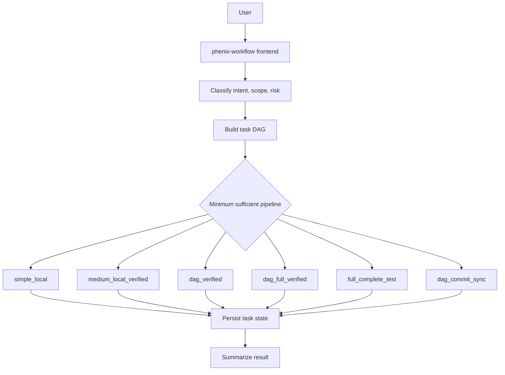

## Task DAG vs Agent DAG

The task DAG is authoritative. Agents execute typed task nodes under explicit
task packets and leases.

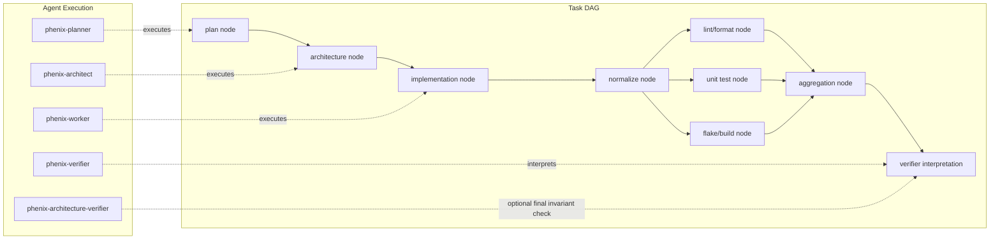

## Pipelines

### Simple Local Pipeline

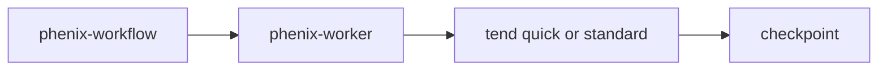

Use for `c1`/`c2` localized single-repo changes with low architectural risk and
clear WorkScope gates.

### Medium Verified Pipeline

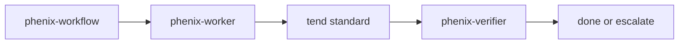

Use for one-subsystem behavioral changes, code plus docs/tests, or work that
benefits from independent verification.

### Complex Architecture Pipeline

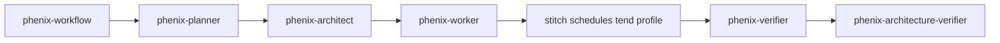

Use for `c4` architecture, workflow, MCP, tend/stitch, flake topology, public API
or config semantics, multi-repo behavior, release/destructive/security actions,
and downstream risk.

### Complex Decomposed Pipeline

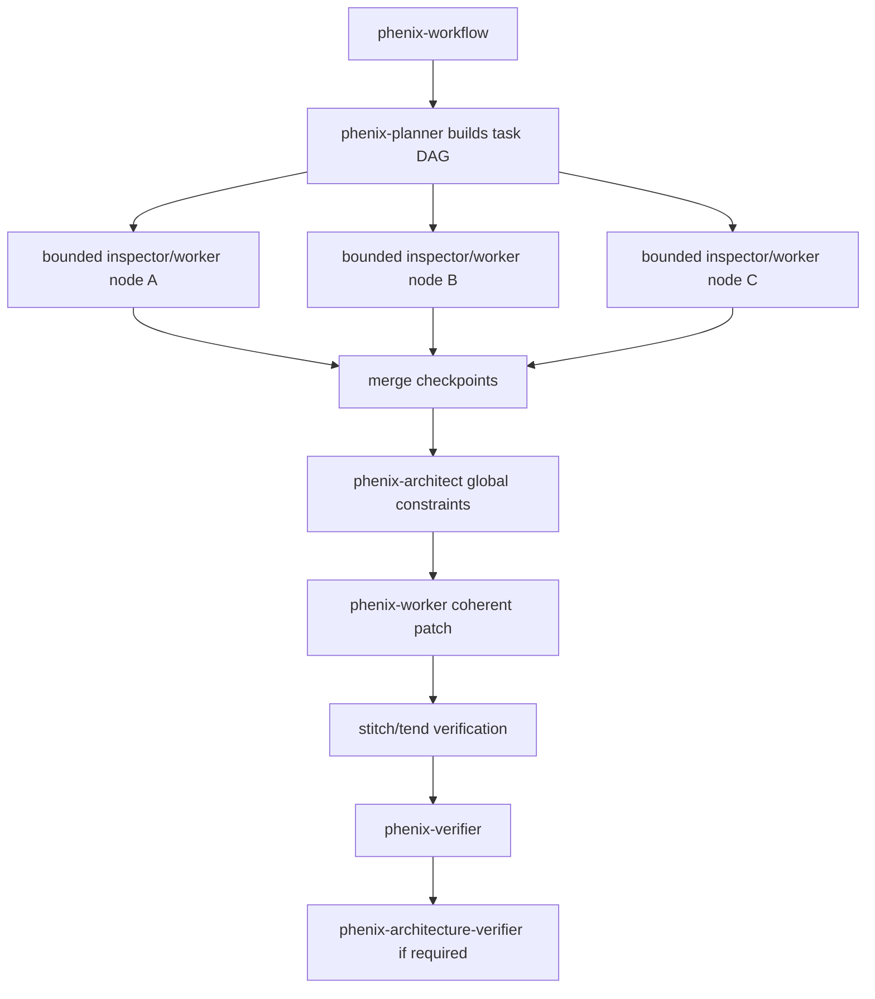

Partitioned workers are allowed only when leases name allowed scope,
planned-change IDs, stop conditions, and checkpoint requirements.

## Tend, Stitch, MCP, And CLI

Agents decide intent, scope, verification profile, and escalation. Stitch decides
DAG scope and execution order. Tend decides what a local task/profile means in
one repo/module. MCP is the preferred structured transport. CLI remains allowed
as fallback, debugging surface, and command-level reproduction path.

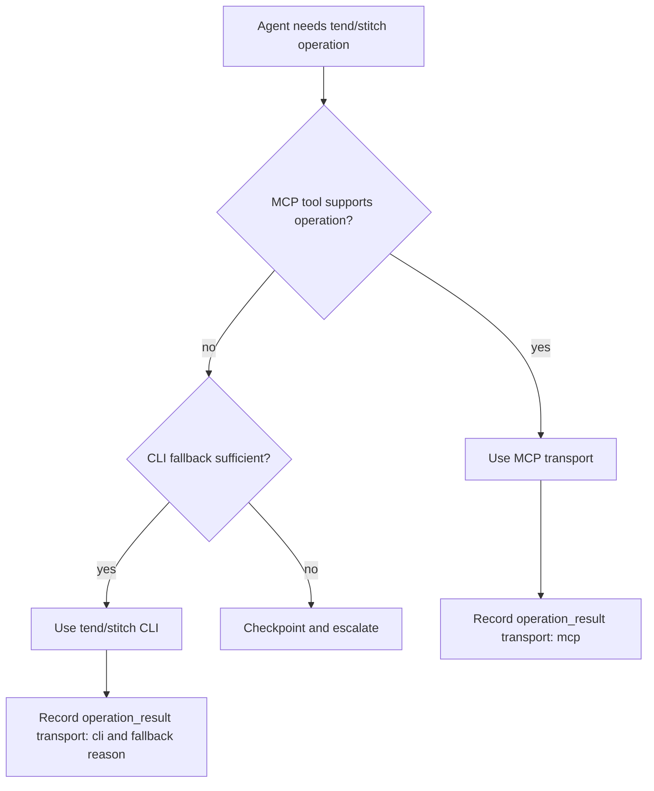

Known MCP tools in the wrapper are:

- tend: `tend-mcp_tend_status`, `tend-mcp_tend_plan`, `tend-mcp_tend_run`, `tend-mcp_tend_explain`;
- stitch: `stitch-mcp_stitch_status`, `stitch-mcp_stitch_diff`, `stitch-mcp_stitch_dag`, `stitch-mcp_stitch_commit_template`, `stitch-mcp_stitch_commit`, `stitch-mcp_stitch_sync`.

Agents must not manually loop through repositories when stitch can express the
scope/order, and must not reconstruct tend profile semantics from raw commands.

## Verification DAG

Verification is a DAG of tool-backed nodes. Mutating normalization runs before
read-only verification branches.

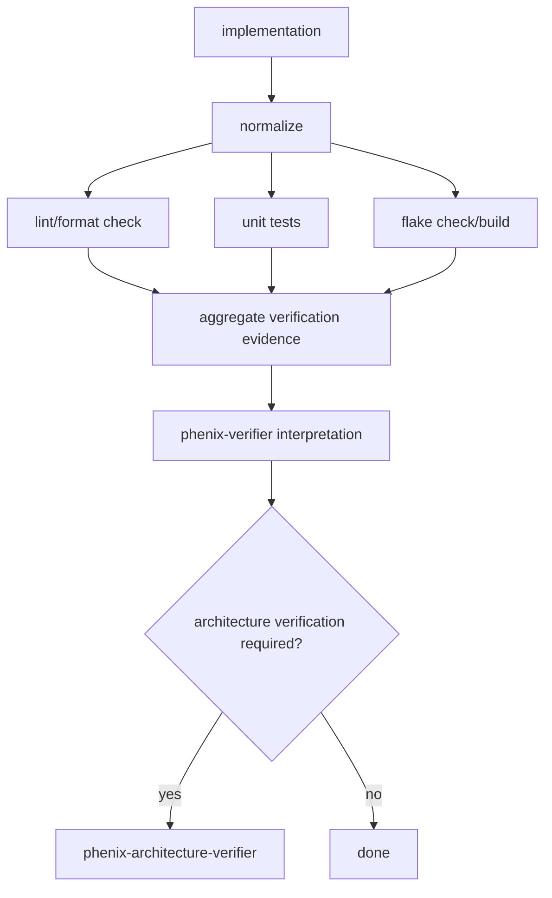

For one repo, tend may execute the profile directly. For DAG scope, stitch must
schedule tend across the selected nodes in DAG order.

## Stitch To Tend Full Verification

Full complete verification is `stitch -> tend(full profile)`.

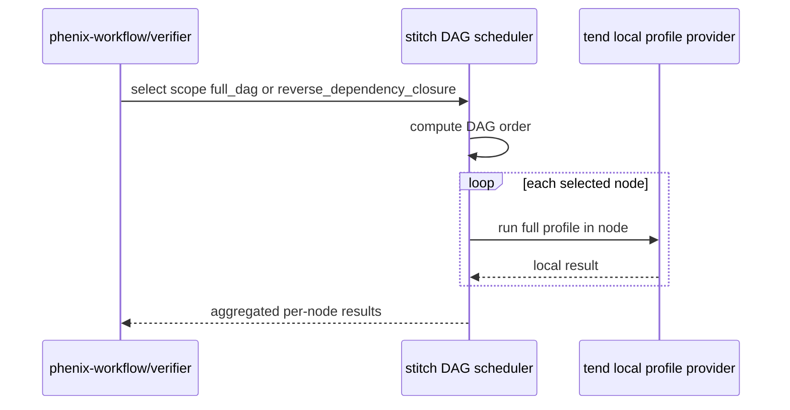

CLI fallback is the installed stitch equivalent of:

```text
stitch exec --scope full-dag --order dag -- tend verify --profile full
```

Use actual supported command names from tend/stitch. For current tend CLI,
`tend plan`, `tend run`, and `tend explain` are canonical; aliases may exist.

## State And Handoff Memory

The existing `.phenix-agent-state/` tree is the durable workflow blackboard.
Stateful runs also store task-DAG state under
`.phenix-agent-state/tasks/<task-id>/`.

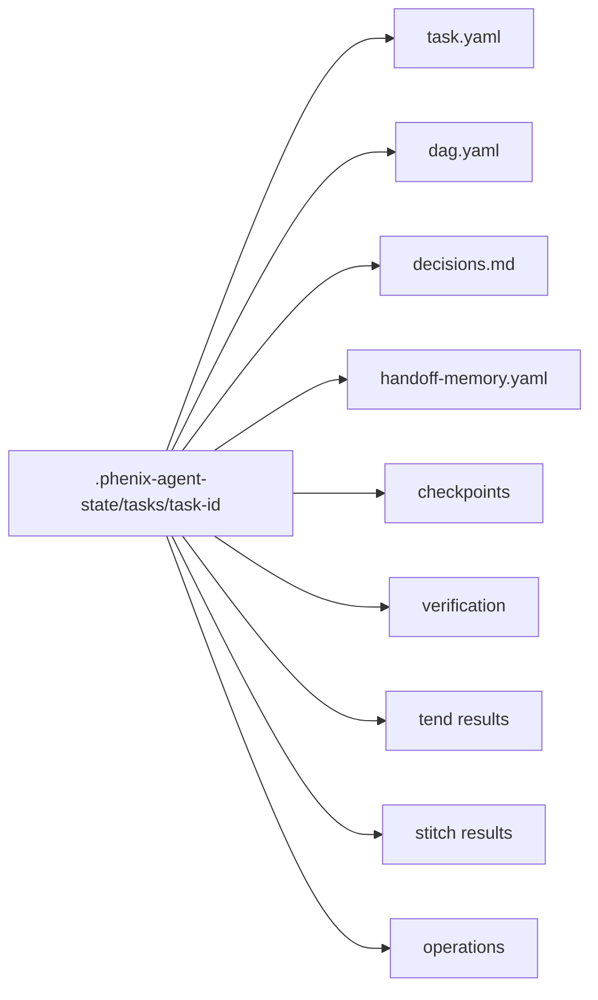

Operation records include:

```yaml
operation_result:
  id:
  logical_executor: tend | stitch
  transport: mcp | cli
  scope: current | affected | dependency_closure | reverse_dependency_closure | full_dag
  order: dag | reverse_dag
  tend_profile: quick | standard | full | precommit
  command:
  mcp_tool:
  status: passed | failed | skipped
  per_node_results: []
```

Every subagent invocation receives handoff memory with task id, original request,
current task DAG, selected pipeline, required verification, accepted decisions,
prior checkpoints, prior failures, scope, non-goals, and required outputs. Natural
chat handoff is not durable state.

## Permission Model

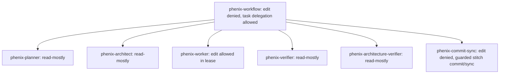

Planners, architects, verifiers, architecture verifiers, and commit-sync agents
are read-mostly. Workers can edit within lease scope. Commits, pushes,
destructive operations, and sync operations remain guarded.

The worker is the data-plane implementation role. For direct c1/c2 work it may
proceed without repeated confirmation when the action is inside WorkScope,
capabilities allow it, invariants and boundaries hold, and the work is reversible
or verifiable. It must stop on escalation triggers instead of broadening scope.

## Escalation And DAG Rewrite

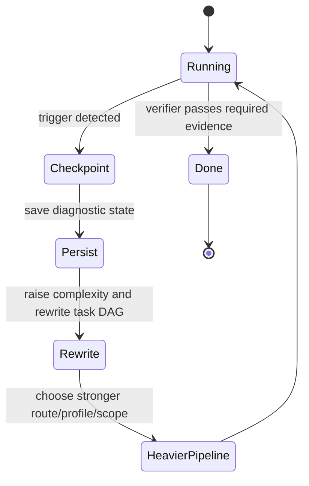

Escalate on repeated verification failure, missing required tend/stitch
capability, MCP missing with insufficient CLI fallback, unexpected stitch DAG
dependency, larger-than-expected affected scope, unrelated edits, architecture
ambiguity, public API/config drift, flake topology drift, commit/sync involvement,
or incoherent checkpoints. Failed work is diagnostic state, not trusted truth.

## State machine

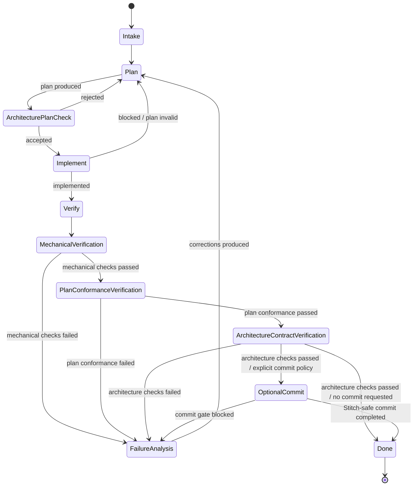

## Verification is three-part

Verification has three mandatory phases in full workflow mode:

1. Mechanical verification:

   * format
   * lint
   * typecheck
   * tests
   * flake checks
   * build checks

2. Plan-conformance verification:

   * final diff matches planned files and operations
   * actual changes map to planned change IDs
   * forbidden expansions avoided
   * expected docs/tests/config changes present
   * deviations justified or require replanning

3. Architecture-contract verification:

   * final diff satisfies the accepted architecture contract
   * intended patterns preserved
   * dependency direction preserved
   * module boundaries preserved
   * allowed/forbidden API changes respected
   * no forbidden architecture drift

## Optional post-verification commit

The workflow does not commit by default. A commit stage is an optional terminal
stage after verifier success. It may run only after mechanical,
plan-conformance, and architecture-contract verification have all passed.

Two routes are allowed:

1. direct workflow commit with an explicit commit policy and Stitch-safe tooling;
2. delegated `review-committer` final review and commit, also after verifier
   success and with an explicit commit policy.

Commit policy follows the glossary: `local commit` does not push; `commit` and
`commit and push` may push the current node; `sync`, `sync commit`, and
`synced commit` are DAG-aware propagation and push routes.

### External-change commit-inclusion

When the working tree contains pre-existing or user-authored dirty files outside
the accepted planned changes, they may be included in a requested commit only
through an explicit gated pipeline:

1. User acknowledgement of each external change.
2. Classification by type (config, documentation, generated artifact, etc.).
3. Secret/credential review.
4. Verifier evidence (mechanical checks) or scoped evidence (manual review).
5. Commit-summary enumeration of all external changes.
6. Stitch-only commit routing.

This gate runs after verifier success and before the commit route executes.
External changes that fail any gate item must block the commit. Agent-authored
changes remain subject to strict plan-conformance regardless of external changes.

## Original plan artifacts

Verification is based on original upstream artifacts, not reconstructed summaries.

Every full `/flow` run must maintain `.phenix-agent-state/` as the durable workflow
blackboard. It stores current request, plan, architecture, implementation,
verification, failure-analysis, and ledger artifacts so agents coordinate from
original records instead of lossy chat summaries.

Required artifacts include:

```text
.phenix-agent-state/request.md
.phenix-agent-state/planner-output.yaml
.phenix-agent-state/implementation-plan.yaml
.phenix-agent-state/planned-changes.yaml
.phenix-agent-state/architecture-review.yaml
.phenix-agent-state/architecture-contract.yaml
.phenix-agent-state/implementation-summary.yaml
.phenix-agent-state/verification-report.yaml
.phenix-agent-state/failure-analysis.yaml
.phenix-agent-state/run-ledger.yaml
.phenix-agent-state/decision-ledger.yaml
.phenix-agent-state/artifact-ledger.yaml
.phenix-agent-state/verification-ledger.yaml
```

Ledger intent:

* run ledger: workflow transitions, selected depth, and handoff timestamps;
* decision ledger: planner and architect decisions that affect scope;
* artifact ledger: files, evidence, and generated handoff artifacts;
* verification ledger: planned and completed checks with outcomes.

The verifier uses these artifacts to check:

1. mechanical correctness;
2. conformance to the original implementation plan;
3. conformance to the accepted architecture contract.

### Plan-conformance verification

Checks whether the final diff matches:

* planned files;
* planned operations;
* expected behavior changes;
* expected docs/tests/config changes;
* forbidden expansions;
* expected diff shape.

### Architecture-contract verification

Checks whether the final diff preserves:

* planned architecture patterns;
* dependency direction;
* module boundaries;
* allowed public API changes;
* forbidden public API changes;
* docs/tests/config expectations;
* forbidden architecture drift.

### Missing artifact rule

If a full `/flow` reaches verification without the original plan artifacts, verification must fail.

Standalone `/verify` may run without workflow artifacts, but it must explicitly state that accepted-plan verification was unavailable.

## Workflow depth routing

Workflow depth is derived from WorkScope risk and complexity:

* shallow (`c0`): read-only exploration, clarification, diagnostics, review, or
  explanation;
* direct trivial (`c1`): obvious mechanical maintenance;
* direct local (`c2`): bounded low-risk tracked edits with minimal preflight and
  no heavyweight state unless recovery/handoff is needed;
* planned (`c3`): semantic or ambiguous work requiring a light plan;
* full (`c4`): architecture-sensitive, workflow/config/control-plane, submodule,
  release/destructive/security, or accepted architecture-contract work.

Full workflow mode still requires planner output, architect acceptance before
implementation, implementer execution against the accepted plan, and verifier
success across mechanical, plan-conformance, and architecture phases.

## Optional specialist critics

Specialist critics may be requested for domain-specific advisory feedback. They
are optional and subordinate to the core gates. A critic cannot replace the
architect plan check or the verifier's final architecture verification.

## Partitioned implementers

When planning explicitly permits parallel or partitioned implementation, each
handoff must name the planned change IDs, repo/submodule ownership, allowed
files, allowed operations, verification expectations, and forbidden expansions
for that partition. The combined final diff remains subject to one verifier
plan-conformance and architecture-contract check.

## Transition table

| From                           | To                             | Required condition                                          |
| ------------------------------ | ------------------------------ | ----------------------------------------------------------- |
| Intake                         | Plan                           | User request can be planned                                 |
| Plan                           | ArchitecturePlanCheck          | Planner produced structured plan                            |
| ArchitecturePlanCheck          | Implement                      | Architect returned `status: accepted`                       |
| ArchitecturePlanCheck          | Plan                           | Architect returned `status: rejected`                       |
| Implement                      | Verify                         | Implementer returned `status: implemented`                  |
| Implement                      | Plan                           | Implementer returned `status: blocked`                      |
| Verify                         | MechanicalVerification         | Verifier starts required checks                             |
| MechanicalVerification         | PlanConformanceVerification    | Mechanical checks passed                                    |
| MechanicalVerification         | FailureAnalysis                | Mechanical checks failed                                    |
| PlanConformanceVerification    | ArchitectureContractVerification | Plan conformance passed                                   |
| PlanConformanceVerification    | FailureAnalysis                | Plan conformance failed                                     |
| ArchitectureContractVerification | Done                         | Architecture checks passed                                  |
| ArchitectureContractVerification | OptionalCommit               | Architecture checks passed and explicit commit policy exists |
| ArchitectureContractVerification | FailureAnalysis              | Architecture checks failed                                  |
| OptionalCommit                  | Done                         | Stitch-safe commit route completed                          |
| OptionalCommit                  | FailureAnalysis              | Commit gate blocked                                         |
| FailureAnalysis                | Plan                           | Failure analyzer produced root causes and corrections       |

## Codebase memory use

For non-trivial tasks, `planner`, `architect`, `verifier`, and `failure-analyzer` should use `codebase_memory` tools for structural orientation before making broad claims about the repo.
