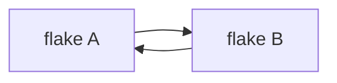
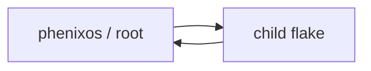
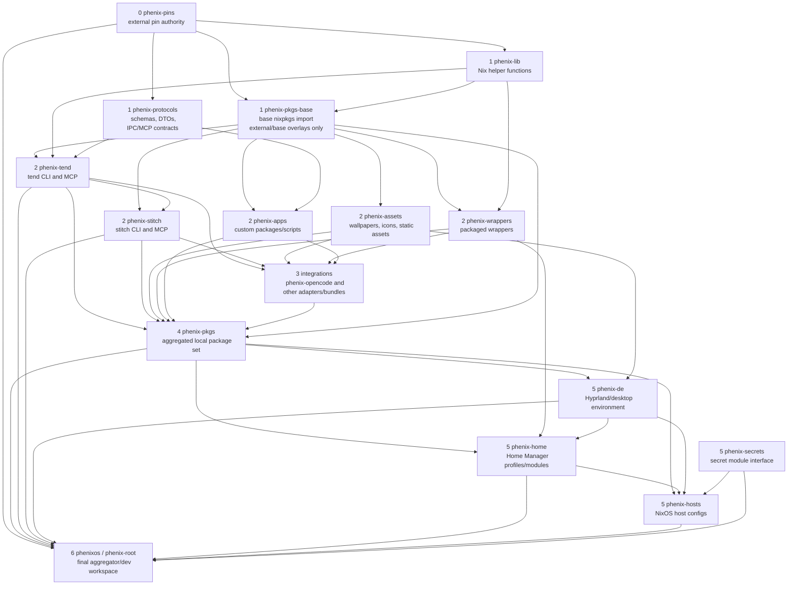
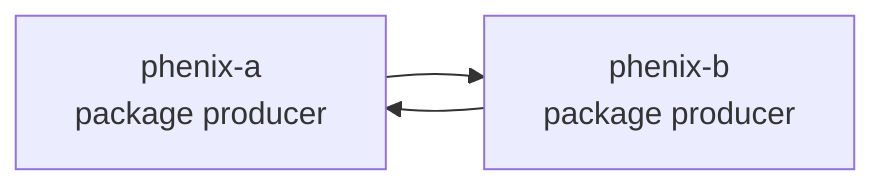
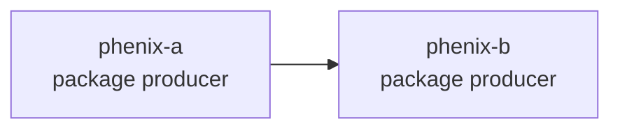
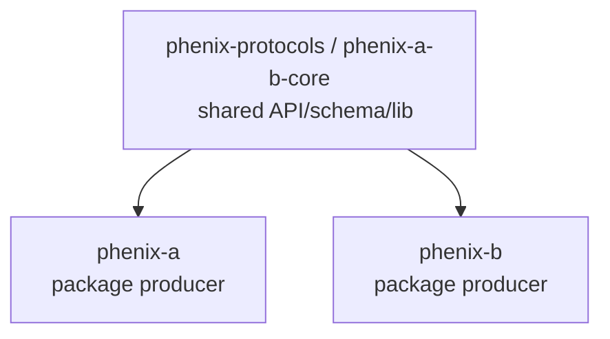
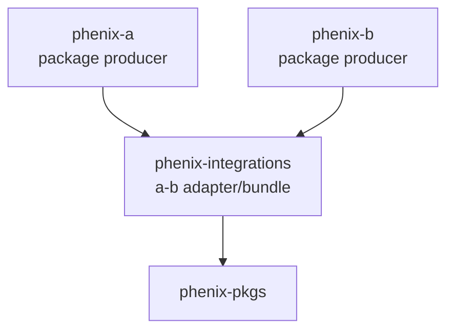
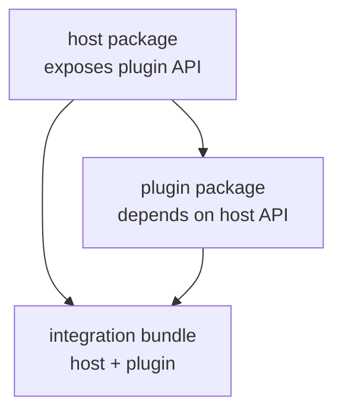
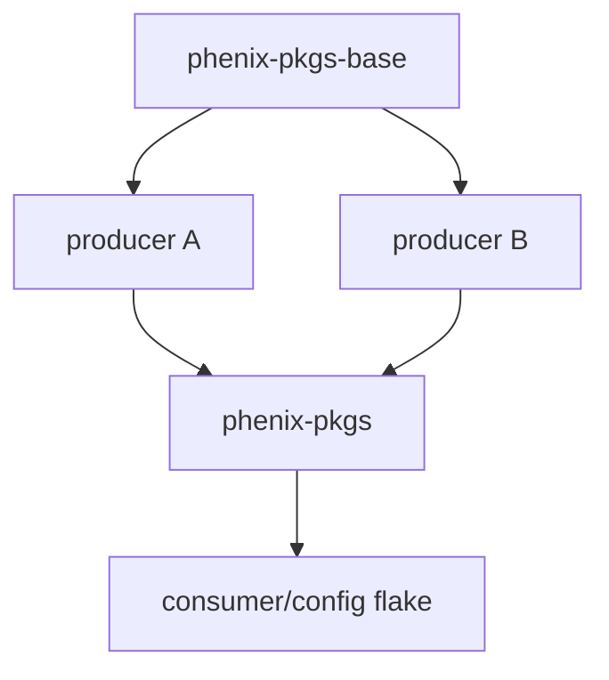
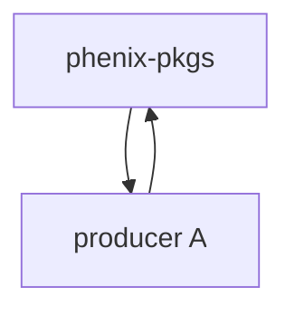

# Phenix flake topology and integration pattern

This document describes the intended Phenix workflow. Items not yet implemented must be tracked in `docs/roadmap.md`.

Phenix uses multiple flakes instead of one monolithic repository. That only works reliably if the published flake-input graph is a directed acyclic graph.

The core rule is:

> A flake may depend on lower-level flakes. It must not depend on flakes at its own level or above it, unless the dependency is modeled through a dedicated lower shared core or a higher integration layer.

This avoids lock-file ping-pong, build cycles, and unclear ownership.

## Why this matters

A published flake input pins a Git revision. If two repos pin each other, every update on one side creates a new commit that the other side then wants to pin.

Invalid shape:



This does not settle cleanly:

```text
A updates B -> commit A1
B updates A -> commit B1
A updates B -> commit A2
B updates A -> commit B2
...
```

The same problem appears when the root flake is used as an input by a child flake that the root also aggregates.

Invalid:



Root is an aggregator. It is not a dependency provider for children.

## Layer model

Phenix flakes are organized by layer.

```text
0 pins
1 lib / overlays / pkgs-base / protocols
2 package producers
3 integrations
4 package-set aggregator
5 consumers / configuration flakes
6 root aggregator
```

Allowed dependency direction:

```text
higher layer -> lower layer
```

The root aggregator is the final composition point. No non-root flake may depend on it.

## Recommended DAG



## Flake roles

### `phenix-pins`

Owns external revision choices.

Examples:

```text
nixpkgs
flake-parts
flake-file
home-manager
quickshell
catppuccin
git-hooks-nix
treefmt-nix
rust overlays
systems
```

It must not depend on other Phenix flakes.

### `phenix-lib`

Owns pure Nix helper functions.

Examples:

```text
wrapper helpers
module helpers
naming helpers
assertion helpers
path helpers
common flake-parts helpers
```

It should avoid depending on `pkgs` directly. Prefer functions that accept `pkgs` as an argument.

### `phenix-pkgs-base`

Owns the base `pkgs` import used by package-producing flakes.

It may include:

```text
nixpkgs from phenix-pins
external overlays
neutral base overlays
build fixes
shared package overrides
```

It must not include local packages from `phenix-tend`, `phenix-stitch`, `phenix-wrappers`, or other package producers.

This split is important:

```text
phenix-pkgs-base = safe input for package producers
phenix-pkgs      = aggregate output for consumers
```

### `phenix-protocols`

Owns shared data contracts.

Examples:

```text
IPC schemas
MCP schemas
launcher action DTOs
tend/stitch JSON schemas
Hyprland state DTOs
shared protocol documentation
```

Use this when two packages need to agree on a common interface.

### Package producers

Package producers build independently and feed the aggregate package set.

Examples:

```text
phenix-tend
phenix-stitch
phenix-assets
phenix-wrappers
phenix-apps
```

Package producers may depend on:

```text
phenix-pins
phenix-lib
phenix-pkgs-base
phenix-protocols
```

They must not depend on:

```text
phenix-pkgs
phenix-de
phenix-home
phenix-hosts
phenixos / root
other same-layer producers
```

### `phenix-integrations`

Owns cross-package wiring between package producers.

Use this when two package producers need to work together.

Examples:

```text
combined wrappers
runtime bundles
tool + shell adapters
desktop integration packages
systemd user service bundles
MCP configs referencing multiple packages
```

Integrations may depend on multiple package producers.

In the current workspace, `phenix-opencode` is a layer-3 integration because it
wraps Opencode configuration together with `phenix-tend` and `phenix-stitch` commands and MCPs.

Package producers must not depend on integrations.

### `phenix-pkgs`

Owns the aggregated package universe.

It may expose:

```text
combined packages
local overlays
package aliases
integrated package variants
default package sets
```

It may depend on package producers and integrations.

It must not be used by package producers.

### Consumer/configuration flakes

Examples:

```text
phenix-de
phenix-home
phenix-hosts
```

These consume `phenix-pkgs`, integrations, and selected direct producers where appropriate.

They may expose:

```text
NixOS modules
Home Manager modules
runtime config
host composition
session config
desktop config
```

### `phenixos` / root

The root flake owns:

```text
workspace aggregation
local dev shell
submodule/path-input wiring
final host selection
one-stop build/check commands
```

It should not define reusable NixOS or Home Manager options of its own. Those belong in child flakes.

No child flake may depend on root.

## Same-level integration rule

Two package producers must not directly depend on each other.

Invalid:



Also invalid by default:



Same-layer producer dependencies make ownership unclear and can easily become cycles.

Use one of the patterns below.

## Pattern 1: extract a lower shared core

Use this when both packages need common schemas, protocols, assets, helpers, or libraries.

Correct:



Example:

```text
phenix-tend and another package producer both need a Tend status JSON schema.
```

Do not make tools and shell packages depend on each other.

Instead:

```text
phenix-protocols -> phenix-tend
phenix-protocols -> other-producer
```

## Pattern 2: put runtime wiring in a higher integration layer

Use this when both packages are independently useful, but a combined package or wrapper should exist.

Correct:



Example:

```text
phenix-tend and phenix-stitch provide workflow tools.
another producer provides runtime assets.
phenix-integrations provides an adapter bundle.
```

## Pattern 3: make host/plugin direction explicit

Use this when the relationship is conceptually asymmetric.

Correct:



The host exposes an extension point. The plugin depends on the host API. The bundle chooses which plugins to include.

The host must not depend on the plugin.

## Pattern 4: merge if the split is artificial

If `A` cannot build, test, or make sense without `B`, and `B` cannot build, test, or make sense without `A`, they are probably one component.

Prefer:

```text
one repo exposing packages.a and packages.b
```

or:

```text
one lower core repo plus two independent packages
```

over two mutually dependent package-provider flakes.

## Build-time versus runtime dependency

A build-time cycle is impossible:

```text
a build-depends on b
b build-depends on a
```

Nix cannot build either derivation first.

Runtime integration is different. If both packages build independently but need to discover each other at runtime, use an integration package or wrapper.

Correct:

```text
a builds independently
b builds independently
a-b-wrapper wires both together at runtime
```

## `phenix-pkgs-base` versus `phenix-pkgs`

Package producers use `phenix-pkgs-base`.

Consumers use `phenix-pkgs`.

Correct:



Invalid:



A package producer that contributes to `phenix-pkgs` must not consume `phenix-pkgs`.

## Follows is not topology enforcement

`follows` is useful to align shared pins.

Example:

```nix
{
  inputs = {
    phenix-pins.url = "github:matthis-k/phenix-pins";

    phenix-tend.url = "github:matthis-k/phenix-tend";
    phenix-tend.inputs.phenix-pins.follows = "phenix-pins";
  };
}
```

But `follows` does not make cycles safe. It reduces duplicated lock nodes and aligns inputs. It does not turn a cyclic Git commit graph into a convergent DAG.

Topology must be enforced by repo roles and allowed dependency direction.

## Allowed dependency table

| From role     | May depend on                                      | Must not depend on                                     |
| ------------- | -------------------------------------------------- | ------------------------------------------------------ |
| `pins`        | external sources only                              | all Phenix flakes                                      |
| `lib`         | `pins`                                             | package producers, `pkgs`, consumers, root             |
| `pkgs-base`   | `pins`, `lib`, external overlays                   | package producers, `pkgs`, consumers, root             |
| `protocols`   | `pins`, `lib`                                      | package producers, `pkgs`, consumers, root             |
| `producer`    | `pins`, `lib`, `pkgs-base`, `protocols`            | other producers, integrations, `pkgs`, consumers, root |
| `integration` | producers, `pins`, `lib`, `pkgs-base`, `protocols` | consumers, root                                        |
| `pkgs`        | producers, integrations, `pkgs-base`               | consumers, root                                        |
| `consumer`    | `pkgs`, integrations, selected producers           | root                                                   |
| `root`        | any internal flake                                 | used by no internal flake                              |

## Edge kinds

Tooling should distinguish edge kinds.

```rust
enum EdgeKind {
    PublishedInput,
    LocalPathInput,
    Aggregates,
    ToolingOnly,
}
```

Rules:

```text
PublishedInput edges must form a DAG.
PublishedInput edges must follow layer direction.
LocalPathInput edges are allowed only for local development and must not hide published cycles.
Aggregates edges belong to root.
ToolingOnly edges do not affect the flake lock DAG.
```

## Stitch enforcement

`stitch` should validate the published flake-input topology.

Recommended role model:

```rust
enum RepoRole {
    Pins,
    Lib,
    PkgsBase,
    Protocols,
    Producer,
    Integration,
    PkgsAggregator,
    Consumer,
    Root,
    External,
}
```

Recommended layer mapping:

```rust
impl RepoRole {
    pub fn layer(self) -> u8 {
        match self {
            RepoRole::Pins => 0,
            RepoRole::Lib => 1,
            RepoRole::PkgsBase => 1,
            RepoRole::Protocols => 1,
            RepoRole::Producer => 2,
            RepoRole::Integration => 3,
            RepoRole::PkgsAggregator => 4,
            RepoRole::Consumer => 5,
            RepoRole::Root => 6,
            RepoRole::External => 255,
        }
    }
}
```

A published internal edge is valid when:

```text
from.layer > to.layer
```

Additional hard rules:

```text
No internal repo may depend on root.
A producer may not depend on another producer.
A producer may not depend on phenix-pkgs.
Root may aggregate children, but children may not depend on root.
Same-layer dependencies are forbidden unless explicitly modeled through protocols or integrations.
```

## Decision tree

When a package provider appears to need another package provider, classify the dependency.

### Does A build-depend on B and B build-depend on A?

This is impossible as separate packages.

Fix:

```text
extract common core
or merge packages
```

### Do A and B only need shared schemas or contracts?

Fix:

```text
phenix-protocols -> A
phenix-protocols -> B
```

### Do A and B need runtime wiring?

Fix:

```text
A -> phenix-integrations
B -> phenix-integrations
phenix-integrations -> phenix-pkgs
```

### Is one actually a plugin for the other?

Fix:

```text
host API -> plugin
host + plugin -> integration bundle
```

### Is the need only for local development tooling?

Do not create a flake dependency.

Use:

```text
root dev shell
direnv
tend/stitch workspace tooling
local PATH
```

## Final invariants

The Phenix flake graph must satisfy:

```text
No published internal cycles.
No non-root flake depends on root.
No package producer depends on phenix-pkgs.
No package producer depends on another package producer.
Same-level integration goes through phenix-protocols or phenix-integrations.
Root composes; it does not provide reusable dependencies to children.
```

These rules preserve a convergent multi-repo workflow while still allowing rich integration between packages.
